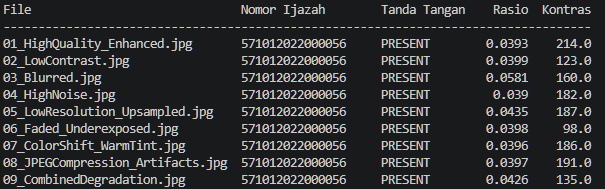
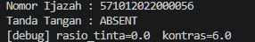

# Mini Project Integrasi — Verifikasi Ijazah (OCR + Deteksi Tanda Tangan)

Tugas Pertemuan 7 — Pengolahan Citra Digital

| | |
|---|---|
| Nama | **Zulfikar Aslam Said** |
| NIM | **F1G124055** |

## Deskripsi

Prototype yang menerima citra ijazah, lalu menghasilkan:

1. **Nomor ijazah**, dibaca dengan OCR (Tesseract).
2. **Status tanda tangan kepala sekolah** (`PRESENT` / `ABSENT`), ditentukan dengan thresholding, morphology, dan analisis komponen terhubung.

Dataset: 9 citra dari dosen berupa **ijazah yang sama** dengan degradasi berbeda (kontras rendah, blur, noise, resolusi rendah, pudar, pergeseran warna, artefak JPEG, dan kombinasi). Seluruh citra tersimpan dalam posisi miring 90°, sehingga semua perintah memakai opsi `--rotate 90`.

## Contoh Output

```
Input : data/01_HighQuality_Enhanced.jpg

Nomor Ijazah : 571012022000056
Tanda Tangan : PRESENT
```

## Pipeline

```
Citra Ijazah
     ↓
Grayscale
     ↓
Image Enhancement
     ├──────────────────────────┬─────────────────────────────┐
Area Nomor                 Area Tanda Tangan
     ↓                          ↓
Enhancement                Thresholding (Otsu)
     ↓                          ↓
OCR (Tesseract)            Morphology (opening + closing)
     ↓                          ↓
Nomor Ijazah               Signature Detection
     └──────────────────────────┴─────────────────────────────┘
                                ↓
                         Hasil Verifikasi
```

## Metode yang Digunakan

| Tahap | Metode | Alasan |
|---|---|---|
| Rotasi | `cv2.rotate` 90° searah jarum jam | Citra dari dosen tersimpan miring; OCR tidak dapat membaca teks yang miring |
| Grayscale | `cv2.cvtColor` BGR → GRAY | Warna tidak dibutuhkan untuk teks dan tinta; mengurangi dimensi data |
| Image Enhancement | `none`, `hist_eq`, `clahe`, `sharpen`, `denoise_clahe` | Memperbaiki kualitas citra sebelum OCR; kelimanya dibandingkan lewat CER |
| Pemisahan area (ROI) | Crop koordinat relatif di `roi.json` | Memisahkan area nomor dan area tanda tangan; koordinat relatif sehingga berlaku untuk semua ukuran citra |
| OCR | Tesseract `--psm 7` + whitelist karakter, area diperbesar 2×, pola nomor dengan regex | Satu baris teks; whitelist menekan salah baca karakter |
| Thresholding | Gaussian blur + Otsu (invers) | Memisahkan tinta tanda tangan dari kertas secara otomatis |
| Morphology | Opening (2×2) lalu closing (7×7) | Opening membuang noise kecil, closing menyambung goresan yang terputus |
| Signature Detection | Syarat kontras minimum (tinta harus ≥ 30 tingkat keabuan lebih gelap dari kertas), lalu connected components (area ≥ 80 piksel); `PRESENT` bila rasio piksel tinta ≥ 1% | Otsu selalu menemukan ambang walau area hanya berisi noise, sehingga syarat kontras mencegah area kosong terdeteksi sebagai tanda tangan |

**Metode enhancement:**

- `none`: tanpa enhancement (pembanding).
- `hist_eq`: histogram equalization global.
- `clahe`: histogram equalization adaptif per blok (8×8, clip limit 2.0).
- `sharpen`: unsharp masking untuk mempertajam tepi.
- `denoise_clahe`: Non-Local Means denoising, kemudian CLAHE.

**Metrik evaluasi:** Character Error Rate

```
CER = (S + D + I) / N
```

S = substitusi, D = penghapusan, I = penyisipan, N = jumlah karakter acuan. Nilai lebih kecil lebih baik. CER dihitung dengan jarak Levenshtein terhadap nomor ijazah yang benar.

## Struktur Repository

```
ijazah-verifier/
├── main.py                  # CLI: proses satu citra
├── run_all.py               # proses semua citra dalam satu folder
├── evaluate.py              # perbandingan metode enhancement (CER + confidence)
├── make_absent_sample.py    # membuat citra uji tanpa tanda tangan (simulasi)
├── pipeline.py              # grayscale, enhancement, OCR, deteksi tanda tangan
├── roi.json                 # koordinat area nomor & tanda tangan
├── results_cer.csv          # hasil evaluasi per citra
├── requirements.txt
├── data/                    # 9 citra ijazah dari dosen
└── docs/                    # tangkapan layar hasil
```

## Cara Menjalankan

### 1. Prasyarat

- Python 3.9 atau lebih baru
- **Tesseract OCR**
  - Windows: https://github.com/UB-Mannheim/tesseract/wiki, kemudian tambahkan folder instalasinya ke `PATH`
  - Linux: `sudo apt install tesseract-ocr`
  - macOS: `brew install tesseract`

Jika Tesseract tidak ada di `PATH` (Windows), tambahkan baris berikut di bawah `import pytesseract` pada `pipeline.py`:

```python
pytesseract.pytesseract.tesseract_cmd = r"C:\Program Files\Tesseract-OCR\tesseract.exe"
```

### 2. Install dependensi

```bash
python -m venv venv
venv\Scripts\activate          # Windows
source venv/bin/activate       # Linux / macOS
pip install -r requirements.txt
```

### 3. Menentukan area nomor dan tanda tangan (ROI)

Repo ini sudah menyertakan `roi.json`, sehingga langkah ini hanya diperlukan jika layout berbeda.

```bash
python main.py data/01_HighQuality_Enhanced.jpg --rotate 90 --select-roi
```

Tarik kotak di sekitar **angka nomor ijazah**, tekan ENTER; lalu tarik kotak di sekitar **tanda tangan**, tekan ENTER. Hasilnya disimpan di `roi.json` dan berlaku untuk semua citra yang layout-nya sama.

### 4. Memproses satu citra

```bash
python main.py data/01_HighQuality_Enhanced.jpg --rotate 90
```

Opsi:

| Opsi | Fungsi |
|---|---|
| `--rotate {0,90,180,270}` | Memutar citra searah jarum jam sebelum diproses |
| `--enhancement {none,hist_eq,clahe,sharpen,denoise_clahe}` | Memilih metode enhancement (bawaan: `denoise_clahe`) |
| `--debug` | Menyimpan citra hasil antara ke folder `debug/` |
| `--select-roi` | Memilih area nomor dan tanda tangan dengan mouse |

### 5. Memproses semua citra

```bash
python run_all.py --images data --rotate 90
```

### 6. Evaluasi metode enhancement (CER)

Karena semua citra adalah ijazah yang sama, cukup berikan satu nomor acuan:

```bash
python evaluate.py --images data --number "571012022000056" --rotate 90
```

Untuk dataset dengan nomor berbeda di tiap citra, gunakan CSV `filename,nomor_ijazah`:

```bash
python evaluate.py --images data --truth data/ground_truth.csv --rotate 90
```

Detail per citra tersimpan di `results_cer.csv`.

### 7. Menguji kondisi tanpa tanda tangan

```bash
python make_absent_sample.py data/01_HighQuality_Enhanced.jpg --rotate 90
python main.py docs/sample_absent.jpg --rotate 90
```

Perintah pertama membuat citra uji dengan area tanda tangan ditimpa warna kertas (simulasi), dan perintah kedua seharusnya menghasilkan `Tanda Tangan : ABSENT`. Gunakan `--rotate` yang sama di kedua perintah. Buka `docs/sample_absent.jpg` untuk memastikan tanda tangannya benar-benar hilang. Tambahkan `--debug` pada perintah kedua untuk melihat rasio tinta dan kontras.

## Hasil Evaluasi Enhancement

Nomor acuan: `571012022000056` (15 digit). Data: 9 citra × 5 metode = 45 percobaan OCR.

| Metode | Rata-rata CER | Rata-rata confidence OCR |
|---|---|---|
| **denoise_clahe** | **0.0000** | **75.4** |
| sharpen | 0.0000 | 72.9 |
| none | 0.0000 | 69.1 |
| clahe | 0.0000 | 66.3 |
| hist_eq | 0.7111 | 27.4 |

### Analisis

1. **Empat metode menghasilkan CER 0** pada seluruh citra (`denoise_clahe`, `sharpen`, `none`, `clahe`). Pada dataset ini, ROI yang rapat, perbesaran 2×, dan whitelist karakter sudah membuat Tesseract cukup tangguh terhadap degradasi.
2. Karena CER seri, **rata-rata confidence OCR Tesseract** dipakai sebagai pemutus. `denoise_clahe` paling tinggi (75.4), sehingga dipilih sebagai metode bawaan prototype. Confidence adalah estimasi internal Tesseract, dan selisih antar empat metode itu kecil, jadi `denoise_clahe` lebih tepat disebut **paling stabil**, bukan jauh lebih akurat.
3. **CLAHE tanpa denoise** memiliki confidence lebih rendah (66.3) dibanding tanpa enhancement (69.1), sedangkan CLAHE yang didahului denoising paling tinggi. Kemungkinan penyebabnya, CLAHE ikut menguatkan noise dan artefak kompresi, dan denoising di depannya mengatasi hal itu. Ini dugaan yang konsisten dengan data, bukan pembuktian.
4. **`hist_eq` paling buruk** (CER 0.7111). Contoh pada `01_HighQuality_Enhanced`: hasil OCR `012022000056`, sedangkan yang benar `571012022000056`, yaitu tiga digit awal (`571`) hilang. Pada citra ROI hasil `hist_eq`, tiga digit awal (`571`) tampak pudar hingga tidak terbaca, sehingga OCR melewatkannya. Kemungkinan penyebabnya, equalization global menghitung histogram seluruh halaman, bukan area nomor, sehingga kontras lokal di bagian kiri area nomor justru menurun. Ini dugaan yang konsisten dengan pengamatan tersebut, belum diuji lebih lanjut.

### Kesimpulan

Berdasarkan CER dan confidence OCR, metode enhancement yang paling efektif pada dataset ini adalah **denoise + CLAHE** (`denoise_clahe`). Equalization histogram global (`hist_eq`) tidak sesuai untuk citra ini karena menurunkan akurasi OCR secara signifikan.

## Hasil Deteksi Tanda Tangan

| Kondisi | Hasil | Bukti |
|---|---|---|
| Ijazah asli (9 citra) | `PRESENT` pada seluruh citra |  |
| Area tanda tangan dikosongkan (simulasi) | **ABSENT ** |  |

## Keterbatasan

- Dataset hanya satu dokumen dengan sembilan variasi degradasi, sehingga hasil belum tentu berlaku untuk ijazah dengan layout lain.
- Posisi area nomor dan tanda tangan bergantung pada `roi.json`; layout yang berbeda memerlukan penentuan ROI ulang.
- Deteksi tanda tangan berbasis rasio tinta di dalam ROI. Stempel atau teks cetak yang masuk ke ROI dapat menyebabkan false positive; parameter `MIN_INK_RATIO` dan `MIN_CONTRAST` di `pipeline.py` dapat disesuaikan.
- Deteksi hanya menentukan ada/tidaknya goresan, **bukan keaslian** tanda tangan.
- Pengujian `ABSENT` memakai citra simulasi (area tanda tangan ditimpa warna kertas), bukan ijazah tanpa tanda tangan yang sebenarnya.
- Confidence OCR adalah estimasi internal Tesseract dan hanya dipakai sebagai pemutus seri.
